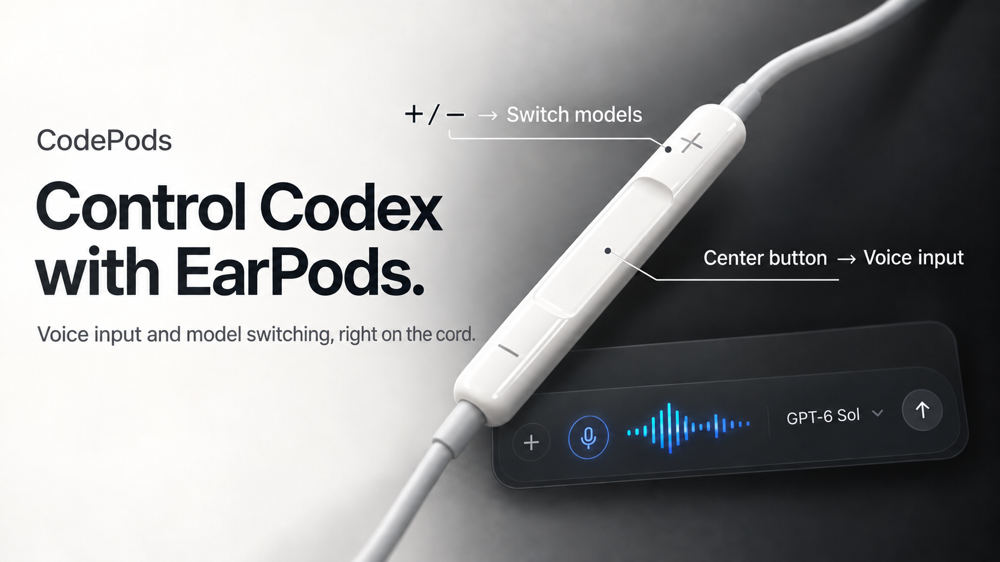

# Codepods (An AI Slop for AI Sloppers)

[日本語](README.ja.md) · English

Use wired EarPods to control the ChatGPT desktop app (Chat / Work / Codex) on macOS. Codepods runs in the menu bar and handles the remote only while ChatGPT is frontmost. Your EarPods retain their usual media controls in other apps.

| EarPods button | In ChatGPT |
| --- | --- |
| `+` / `−` | Cycle through up to three entries in **Recent Models** |
| Center press | Start voice input; press again to stop |

The menu bar shows the selected model and whether voice input is on. The interface follows the Mac's language setting: English, Japanese, Korean, and Simplified Chinese are included; other languages use English.

## Download and install

1. Download `Codepods-0.1.0-macos-arm64.zip` from [GitHub Releases](https://github.com/loutlot/codepods/releases/latest).
2. Unzip it and move `Codepods.app` to **Applications**. Keep it at this location so macOS can retain its permissions.
3. Open Codepods. Because this community build is **not Developer ID signed or notarized**, macOS may block the first launch. After trying to open it, go to **System Settings → Privacy & Security → Open Anyway**, then confirm **Open**. See [Apple's instructions](https://support.apple.com/guide/mac-help/open-a-mac-app-from-an-unknown-developer-mh40616/mac).
4. In the Codepods menu, open **Settings & Permissions…**. Use the buttons to open the Accessibility and Input Monitoring settings. Drag the Codepods icon from the setup window into each app list if needed, and enable both switches.
5. Connect 3.5 mm or USB-C wired EarPods. The setup window will show when they are detected.

Accessibility lets Codepods read and operate ChatGPT's controls. Input Monitoring lets it capture the EarPods buttons and keep the center press from also controlling other media while ChatGPT is frontmost. You must approve both permissions yourself. An ad hoc signed update may require you to approve them again.

## Requirements and limits

- macOS 14 or later on Apple silicon; the current release is arm64 only.
- Wired Apple EarPods with a three-button remote, via 3.5 mm or USB-C.
- The current ChatGPT desktop app (`com.openai.codex`). Codepods follows its on-screen controls, so a future ChatGPT UI change may require a Codepods update.
- The center button toggles ChatGPT's press-and-hold voice input shortcut. Other apps continue to receive ordinary media controls.

Codepods runs locally and sends no telemetry. The source is available in this repository. To build it yourself, install Xcode and run `./build.sh`; the app appears at `dist/Codepods.app`.
